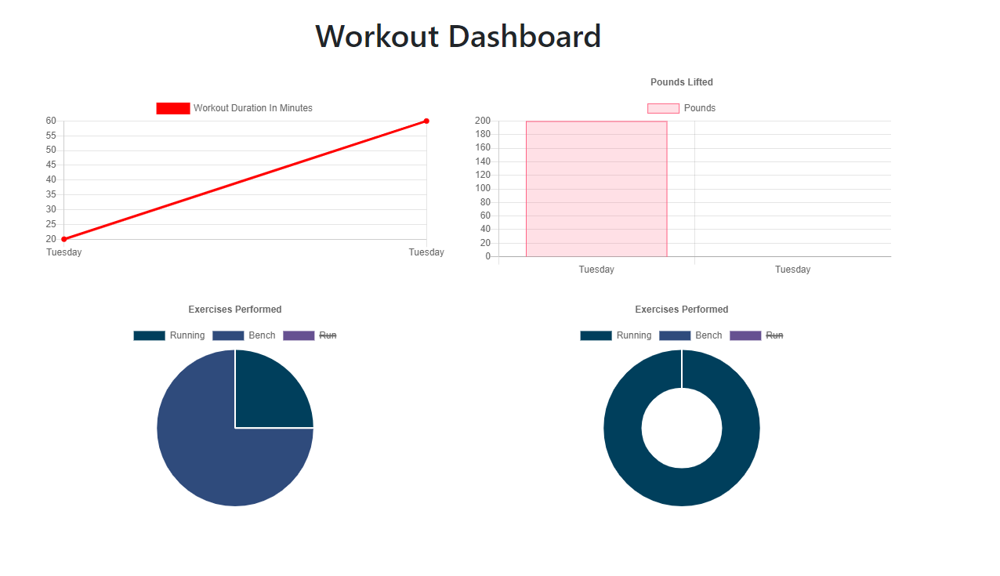
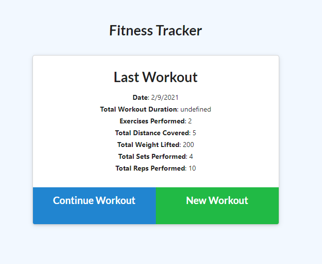

# Fitness Tracker 

## Description:

This app is designed to track a series of workouts, their durations, date of completion, total weight used, etc. Upon deployment much of the app, that functioned locally, broke. This was not intended.

## Screenshots

## Technologies:

-mongoDB
-node
-express
-mongoose
-css, js
-heroku
-MongoDB Atlas

## Contributors:

- [James Totah ](https://github.com/jtwob)

## Links

- [Live App](https://polar-river-32276.herokuapp.com/)
- [Github Repo](https://github.com/jtwob/Workout-Tracker)
